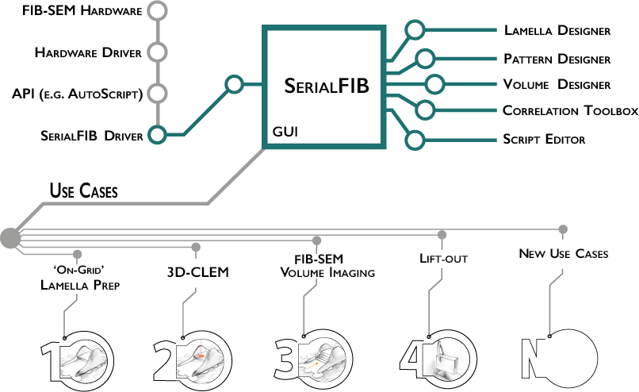

# README #

## SerialFIB ##

A Modular Platform for Streamlining Automated Cryo-FIB Workflows 

SerialFIB is developed at the Max Planck Institute of Biochemistry, Research Group CryoEM Technology and the Mahamid group, European Molecular Biology Laboratory (EMBL). 

It is written in Python3, comes with a PyQt5 GUI, and uses code from 3DCT [http://3dct.semper.space](http://3dct.semper.space)
So far, it has only been developed with Thermo Fisher Scientific AutoScript4. While we did our best to seperate SerialFIB's image handling from AutoScript4, other drivers have not been written yet, so its usage is limited to Thermo Fisher Scientific Instruments. It has been tested on 
the Aquilos and Scios system. AutoScript4 is commercially available from Thermo Fisher Scientific. 

While we did our best to provide a bug-free version, there will surely be things we missed. With questions, bug reports, and feature requests, please contact: 
klumpe (at) biochem.mpg.de

### Installation ###
Once AutoScript4 (version 4.0 and higher) has been installed on your system , the only package that is missing should be PyQt5.
It can be install simply via pip by typing

    pip install PyQt5

into the command line. 

Then, on the PC used to run SerialFIB (usually the Support PC on TFS DualBeam systems), simply clone the repository 

    git clone http://github.com/sklumpe/SerialFIB

and start the program by typing

    python SerialFIB.py

Alternatively, you can create a shortcut on the Desktop. Simply create one that points first to the python executable of your AutoScript4 
installation and then the path to the repository, pointing at the SerialFIB.py file. On our systems, this would e.g. look like this: 

	"C:\Program Files\Python35\envs\AutoScript\python.exe" D:\SharedData\SerialFIB\SerialFIB.py

Furthermore, in the same shortcut, please make sure to start the program in the directory of the GitHub repository, in this case:  

	D:\SharedData\SerialFIB

The SerialFIB GUI can also be run locally, either with a virtual AutoScript4 machine to enable response from the virtual microscope, 
or simply by starting SerialFIB (python SerialFIB.py). This will load dummy images found in the ./DummyImages/ directory of the repository.

For local installation without AutoScript4, the dependencies are: 

+ PyQt5
+ numpy
+ cv2
+ pickle
+ scikit-image

They can be installed by typing

    pip install PyQt5 numpy opencv-python PyWavelets scikit-image 

into the command-line of your OS.

### Usage ###

A tutorial on how to use SerialFIB can be found in the repository. [https://github.com/sklumpe/SerialFIB/blob/main/20210428_SerialFIB_Tutorial.pdf](https://github.com/sklumpe/SerialFIB/blob/main/20210428_SerialFIB_Tutorial.pdf).

Tutorial videos with explanations on how SerialFIB works and its usage are uploaded to [YouTube](https://www.youtube.com/watch?v=QR7ngJ0apBk&t=0s).

Scripting examples are given in the ./ScriptingExamples/ directory and include unit test we used during development. 

The analysis script for SEM images produced by SerialFIB's volume imaging module can be found in the directory ./analysis/ . Generaly usage is

    python processSEM.py -indir INPUT_DIRECTORY -outdir OUTPUT_DIRECTORY

where input_directory holds the images to be processed. 

All adjustable parameters can be viewed by the -h flag. 

### License ###

Initial Release

Copyright (C) 2021 Sven Klumpe EMBL/Herman Fung EMBL/Sara Goetz Jürgen Plitzko EMBL/Julia Mahamid

Added Modules

Zeiss 
Copyright (C) 2022 Sven Klumpe Roland Salzer

	This program is free software: you can redistribute it and/or modify
	it under the terms of the GNU General Public License as published by
	the Free Software Foundation, either version 3 of the License, or
	(at your option) any later version.

	This program is distributed in the hope that it will be useful,
	but WITHOUT ANY WARRANTY; without even the implied warranty of
	MERCHANTABILITY or FITNESS FOR A PARTICULAR PURPOSE.  See the
	GNU General Public License for more details.

	You should have received a copy of the GNU General Public License
	along with this program.  If not, see <http://www.gnu.org/licenses/>.

### Version ###

Version 1.0 is the first public release.

### Citing ###

We ask users to cite:

* The general [paper](https://doi.org/10.7554/eLife.70506) on the automation software (previous [biorxiv](http://www.biorxiv.org/content/10.1101/2021.05.19.444745v1) .
* The [paper](http://dx.doi.org/10.1016/j.bpj.2015.10.053) that forms the basis of the 3D Correlation Toolbox

Thank you for your support!
